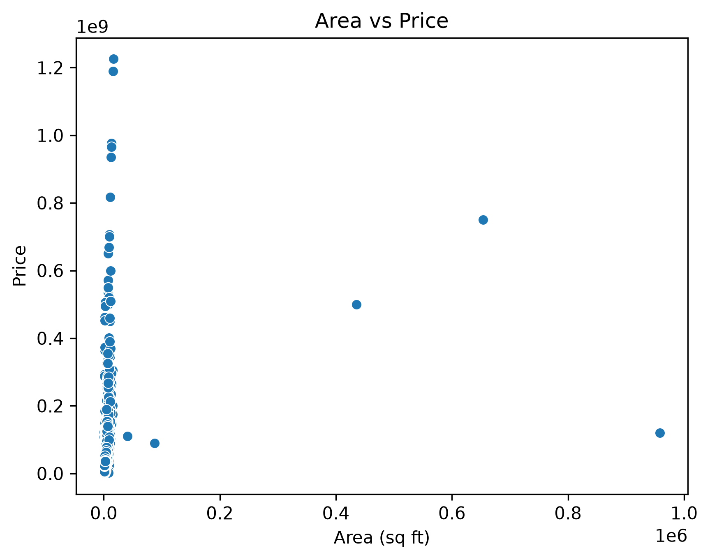
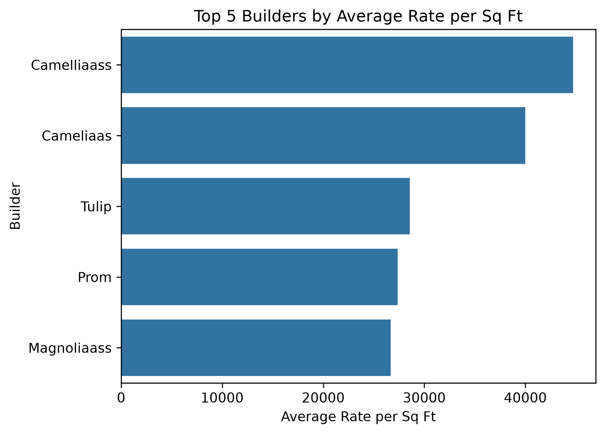
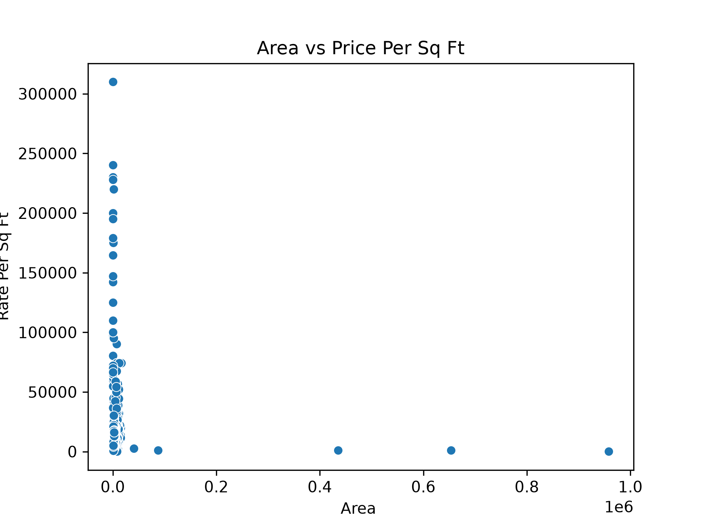

# 🏠 Gurugram Real Estate Analysis

A Python-based Data Analysis project that explores the Gurugram real estate market using **Pandas**, **Matplotlib**, and **Seaborn**. The project focuses on data cleaning, exploratory data analysis (EDA), and visualizations to uncover meaningful insights from property listings.

---

## 📌 Project Overview

The dataset contains information about residential properties in Gurugram, including:

- Property Price
- Area
- BHK Configuration
- Locality
- Builder
- Property Type
- Property Status
- RERA Approval
- Rate per Square Foot

After cleaning the dataset, the project answers important business questions related to pricing, localities, builders, and property characteristics.

---

## 🛠️ Technologies Used

- Python
- Pandas
- Matplotlib
- Seaborn

---

## 📂 Project Structure

```
gurugram-real-estate-analysis/
│
├── data.csv
├── gurugram.py
├── Area_vs_price.png
├── Area_vs_rate.png
├── top_5_builders.png
├── requirements.txt
├── README.md
└── .gitignore
```

---

## 📊 Business Questions Answered

- Which is the costliest flat in the dataset?
- Which locality has the highest average property price?
- Which locality has the highest average rate per square foot?
- Do ready-to-move properties cost more than under-construction properties?
- Do RERA-approved properties command a price premium?
- How does property area impact price?
- Which BHK configuration is the most expensive?
- Which property type is the costliest?
- Which builders charge the highest average rate per square foot?
- Are larger homes more expensive per square foot?

---

## 📈 Visualizations

### 1. Area vs Price



---

### 2. Top 5 Builders by Average Rate per Sq Ft



---

### 3. Area vs Rate Per Sq Ft



---

## 🔍 Key Insights

- The dataset identifies the costliest residential property in Gurugram.
- It highlights the locality with the highest average property price.
- It identifies the locality with the highest average rate per square foot.
- The project compares ready-to-move and under-construction properties.
- It evaluates whether RERA-approved properties command a price premium.
- It determines the most expensive BHK configuration.
- It identifies the most expensive property type.
- It ranks the top five builders based on average rate per square foot.
- Scatter plots are used to study the relationship between area, price, and price per square foot.

---

## ▶️ How to Run

### 1. Clone the repository

```bash
git clone https://github.com/harshitchahar2610/gurugram-real-estate-analysis.git
```

### 2. Move into the project directory

```bash
cd gurugram-real-estate-analysis
```

### 3. Install the required libraries

```bash
pip install -r requirements.txt
```

### 4. Run the project

```bash
python3 gurugram.py
```

---

## 📦 Requirements

```
pandas
matplotlib
seaborn
```

---

